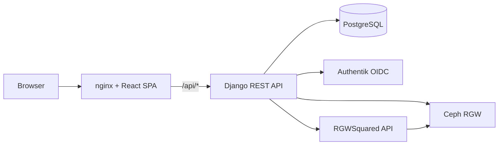
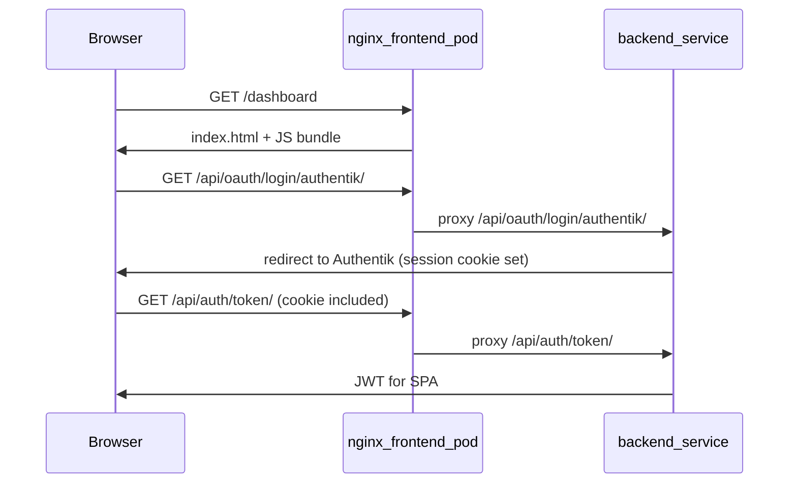
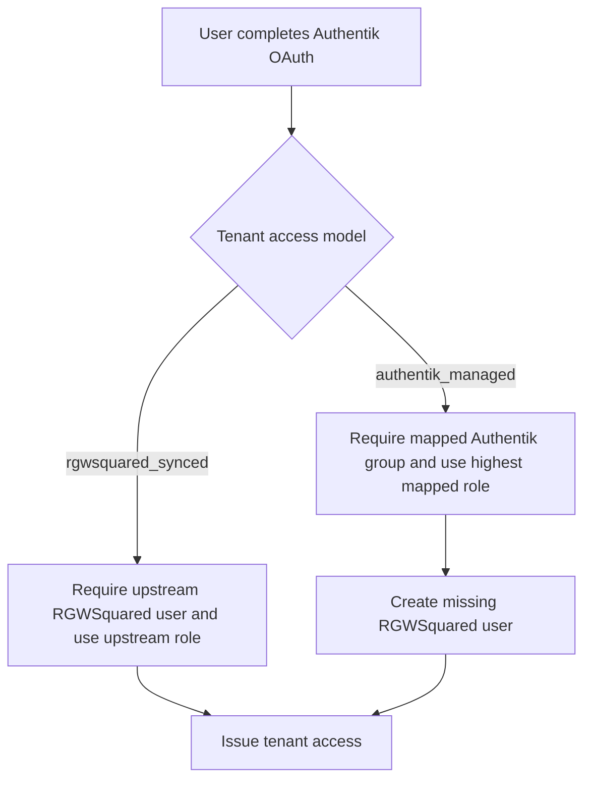

# Buckets Explorer Maintainer Guide

Buckets Explorer is a tenant-aware web app for using Ceph RGW storage without
asking researchers to know Ceph, S3 policies, or RGWSquared internals. Django
stores the application state that makes the UI usable. RGWSquared owns storage
policy and bucket lifecycle. Ceph RGW stores object data.

## Architecture



The browser talks to nginx. nginx serves the React bundle and proxies `/api/*`
to Django. Django authenticates users through Authentik, stores app metadata in
PostgreSQL, asks RGWSquared for tenant and permission state, and uses transient
RGWSquared S3 credentials for object operations in Ceph.

The central boundary is:

- RGWSquared owns bucket lifecycle, bucket permissions, structure readiness, and
  transient S3 credential issuance.
- Django owns webapp metadata, tenant activation state, UI sharing records, file
  upload records, admin views, and local cache records.
- Ceph RGW owns object storage.

### Storage cache and redeploy

Django is a **cache** of RGWSquared policy for UI purposes, not the source of truth for object bytes. After a PostgreSQL wipe (Class C deploy), admin **Sync → Refresh local cache** recreates `Bucket` rows from `bucketList` for admin inventory. Orphan manual buckets (not created via the webapp) are flagged **ORPHAN** in the admin panel only — they receive no `BucketPermission` rows and never appear on user dashboards.

**Orphan prevention:** researchers must create buckets through the webapp (`POST /api/buckets/`), which sets `display_name`, `source=local` owner permission, and RGWSquared policy together. Avoid creating manual buckets directly in RGWSquared. After any database wipe, review **ORPHAN** badges and delete stale buckets promptly.

See [storage-cache-and-redeploy.md](storage-cache-and-redeploy.md) for Class A/B/C checklists.

## Why nginx in the frontend pod

The frontend container runs **nginx**, not Node.js. Vite compiles React at image build time; the running pod only serves static files and proxies API traffic.

nginx has two jobs (see `frontend/nginx.conf`):

1. **Static file server** — serves the compiled SPA. React Router paths (`/dashboard`, `/auth/callback`, `/admin/login`) fall back to `index.html`.
2. **Reverse proxy (BFF)** — forwards `/api/*` to `backend-service:8000`.

**Why same origin matters:** OAuth login sets a Django session cookie. Browsers send cookies only to the same origin. If the UI were on port 3000 and Django on port 8000 as separate origins, the session cookie would not be sent on `/api/auth/token/` and login would fail. nginx makes both appear as one origin (`https://<domain>/`).



## Identity and Login

The app uses several usernames because each system has a different job.

| Field | Source | Purpose |
| --- | --- | --- |
| `User.external_id` | Authentik OIDC `sub` | Stable federation identity. |
| `User.email` | Authentik OIDC `email` | Contact attribute and first source for display naming; not an identity key. |
| `User.display_username` | Derived from email local part | Stable user-facing name used in the UI, sharing, and local bucket naming. |
| Authentik `preferred_username` | Authentik | Ceph-facing username candidate. |
| `TenantMembership.ceph_username` | Authentik/RGWSquared | Username sent to RGWSquared and represented in Ceph subuser IDs. |

The display username is deliberately separate from the Ceph username. A user
should see a readable name, while the backend still needs the exact RGWSquared
username for policy calls.

OIDC `sub` defines an account. Two Authentik accounts with the same email create
two Django users because their groups, staff status, and Ceph usernames can
differ. `display_username` resolves the human-readable collision by adding a
numeric suffix. Never merge accounts by email.

Login is tenant-gated. A user can authenticate successfully at Authentik and
still be denied by Buckets Explorer if no activated tenant is eligible. The app
accepts partial multi-tenant login: if a user belongs to several tenants and one
tenant is not ready, login still succeeds for the tenants that are ready.

Tenant access has two explicit models selected when the tenant is activated:

- `rgwsquared_synced`: refresh imports upstream users and RO/RW roles.
  Authentik supplies one eligibility group that gates login.
- `authentik_managed`: users register only after a login containing a mapped
  Authentik group; mapped RW takes precedence over mapped RO.

Users may carry any number of Authentik groups. Only groups present in
`GroupTenantMapping` affect tenant access; unrelated groups are ignored.
Membership activity records upstream storage presence. Revocation is separate:
`access_revoked_at` is null for usable access and timestamped only when a
mapping is removed or a later login no longer contains the group.

Deleting a mapping never deletes the user, membership, permissions, uploads, or
audit data. If a user last presented both RW and RO groups, deleting the RW
mapping immediately falls back to RO. Otherwise access is revoked. Recreating a
mapping does not silently restore revoked access; a successful later login
re-evaluates current claims and clears revocation. Every bucket and file
operation checks active membership, valid tenant mapping, and revocation state,
so an old JWT cannot retain access.

NFFADI uses `rgwsquared_synced` with the fixed eligibility group
`nffa-di-users`. RGWSquared user and bucket state determines RO/RW. Simple
tenants use `authentik_managed`, normally with `{tenant}-users` for RW and
`{tenant}-ext` for RO.

### User provisioning by access model

**`rgwsquared_synced`:** The institution or research programme pre-provisions
users. Admin refresh imports the upstream roster, memberships, roles, proposal
buckets, and permissions. The login pipeline requires the configured eligibility
group and rejects a username absent from RGWSquared. The webapp never calls
`userCreate` for these tenants.

**`authentik_managed`:** A successful login with a mapped group creates the
Django membership. If the user is absent from RGWSquared, the pipeline calls
`userCreate`; the highest mapped role wins. Admin refresh processes only
already-registered OIDC users and reports unknown upstream identities as
`users_skipped_unregistered` instead of creating placeholders.



Implementation references:

- `storage/pipeline.py` validates the eligibility chain and reconciles revocation.
- `storage/services/sync_service.py` imports upstream rosters only for
  `rgwsquared_synced` tenants.
- `storage/services/rgw_squared.py` implements `userCreate` for
  `authentik_managed` first login.

Configure the access model and group mapping before first login. Missing
configuration raises `AuthForbidden`; it must never be treated as implicit
authorization.

## Tenant Activation

The admin Tenants page is the operator workflow for turning an RGWSquared
structure into a usable webapp tenant. A tenant is fully active only when users
can actually enter and work inside that tenant.

The activation checks are sequential:

1. RGWSquared structure is initialized.
2. Local Django tenant record exists.
3. Authentik group mapping exists.
4. UO coverage is ready when the tenant has UO mapping rows.

UO coverage is outcome-based. It counts only active write-capable memberships
(`rw` and `admin`); read-only memberships should not carry UO codes and are
cleaned during login and refresh flows.

The per-tenant `Refresh` button is not cosmetic. It calls the admin refresh API,
which pulls current RGWSquared state into Django using `structureInfo`,
`bucketList`, `userList`, and `userInfo`. Use it after upstream changes, after a
CSV upload, or when the admin panel shows stale members, buckets, storage, or UO
coverage.

## Buckets

Buckets Explorer shows two bucket types.

| Type | Source | Delete behavior | Permission source |
| --- | --- | --- | --- |
| Proposal bucket | RGWSquared upstream project state | Not deletable from Buckets Explorer | RGWSquared |
| Local bucket | Created by a write-capable tenant user | Owner can delete it | Django local sharing pushed to RGWSquared |

Proposal buckets represent official project or collaboration storage. Their
membership comes from upstream research/project records, so the app does not let
users delete or share them locally.

Local buckets are researcher-owned workspaces. A write-capable user creates one
by entering a short project ID. The app derives the generated bucket name, sends
that bare name to RGWSquared, and then stores local metadata. RGWSquared owns
the physical Ceph bucket layer: when it provisions or reports the storage bucket,
the physical name is tenant-prefixed, conceptually
`{tenant}-{generated-bucket-name}`. Owners can share local buckets with tenant
members. Read-only tenant members can
only receive read-only shares. Write access requires a write-capable tenant
membership.

All buckets use the same read/write object permissions:

- `owner` can upload, download, share, and delete the bucket when it is local,
- `rw` can upload and download; shared RW users can delete only their own files,
- `ro` can view and download only.

## Bucket Names

Buckets Explorer deliberately separates user-facing names from storage names. A
researcher does not need to see tenant prefixes, usernames, or UO segments while
working with a bucket. Admins do need those details when debugging storage state.

| Name | Stored in | Meaning |
| --- | --- | --- |
| Display bucket name | `Bucket.display_name` in Django | User-visible project ID, such as `project-a`. |
| Generated bucket name | `Bucket.name` in Django | Bare name the webapp sends to RGWSquared and uses for object operations with tenant-scoped credentials, such as `alice-cnr-iom-ts-project-a`. |
| Physical Ceph bucket name | RGWSquared/Ceph | RGWSquared-managed tenant-prefixed storage name, conceptually `{tenant}-{generated-bucket-name}`. |

Users type only the project ID. The backend generates the bare bucket name stored
in Django so different users can safely choose the same visible project ID
without colliding inside the tenant. RGWSquared then applies the tenant-level
physical prefix when it provisions the bucket in Ceph. The app treats that
prefix as an RGWSquared/Ceph concern; it is not part of the user-visible bucket
name.

For local buckets:

- NFFADI with a UO code: `{display-username}-{uo-code}-{project-id}`
- Other tenants or users without UO naming: `{display-username}-{project-id}`

The generated name is lowercase, hyphen-separated, and S3-safe. Dots and other
unsafe characters become hyphens. The app sends this generated bare name to
RGWSquared. It does not manually prepend the tenant prefix; RGWSquared owns that
physical Ceph naming layer.

Proposal buckets are synced from RGWSquared. Their display name is usually the
bare upstream bucket or project identifier.

User views show `display_name` first. Admin bucket and permissions views expose
both `display_name` and storage identity. The current admin UI shows the
generated name with tenant context, such as `TENANT/generated-name`; when this
is compared with RGWSquared or Ceph operator output, the physical bucket is the
tenant-prefixed form, such as `tenant-generated-name`. This split is
intentional: users get a clean project name, while operators can still trace the
full storage identity.

## File Names and Upload Records

Uploads are renamed before they are written to Ceph. The rename policy makes
file provenance visible from the object key.

| Tenant and bucket type | File key pattern |
| --- | --- |
| NFFADI proposal | `{tenant}-{bucket-display}-{uploader-uo}-{filename}` |
| NFFADI local | `{tenant}-{uploader-uo}-{bucket-display}-{filename}` |
| Other proposal | `{tenant}-{bucket-display}-{filename}` |
| Other local | `{tenant}-{bucket-display}-{filename}` |

The final filename is sanitized to lowercase S3-safe text. The original filename
is not trusted as an object key. For NFFADI, the UO code comes from the uploader,
not from the bucket owner, so shared RW uploads still carry the right governance
signal.

Every upload creates or updates a `FileUploadRecord`. That record lets the app
show who uploaded a file and enforce the shared-bucket deletion rule: bucket
owners can delete any file; shared RW users can delete only files they uploaded.

Tenant Refresh also inventories Ceph objects in buckets that already have a
trusted `BucketPermission`. Objects created outside the app are stored with
`origin=discovered` and `uploaded_by=null`; the app never guesses provenance.
The object's ETag and last-modified timestamp detect replacement under an
existing key. A changed object loses stale app-uploader attribution. Records are
removed only after a successful S3 listing proves the object is absent.

## Database Model

The database is not a copy of Ceph. It is the state needed to make the UI,
tenant selection, sharing, audit, and admin workflows work.

The table summaries below show Buckets Explorer's application fields. Standard
Django auth columns inherited by the custom user model are omitted for clarity.

### Relationships

| From | Relationship | To | Purpose |
| --- | --- | --- | --- |
| `users` | one-to-many | `tenant_memberships` | A federated account can belong to multiple tenants. |
| `tenants` | one-to-many | `tenant_memberships` | A tenant contains its active and inactive members. |
| `tenants` | one-to-many | `buckets` | Buckets are tenant-scoped. |
| `users` | one-to-many | `buckets` | Local buckets keep the creator as owner; proposal buckets have no owner. |
| `buckets` | one-to-many | `bucket_permissions` | Bucket access is represented per user. |
| `users` | one-to-many | `bucket_permissions` | Users receive `owner`, `rw`, or `ro` bucket permissions. |
| `buckets` | one-to-many | `file_upload_records` | Upload records track object keys and file sizes. |
| `users` | one-to-many | `file_upload_records` | Upload records preserve who uploaded each object. |
| `tenants` | one-to-many | `uo_mappings` | UO mappings assign operational-unit codes for tenants that require them. |
| `tenants` | one-to-many | `group_tenant_mappings` | Authentik groups activate tenant access and initial roles. |
| `tenants` | one-to-many | `file_name_rules` | Filename rules define tenant-specific upload checks. |
| `tenants` | one-to-one | `tenant_documents` | A tenant can expose one Markdown guide to users. |

### Tables

#### `users`

| Column | Meaning |
| --- | --- |
| `id` | Primary key. |
| `username` | Django username, usually derived from the federated identity. |
| `display_username` | Unique stable display name used in UI, sharing, and local bucket naming. |
| `email` | Contact email from the identity provider; multiple OIDC subjects may share it. |
| `external_id` | Unique OIDC `sub` identifier. |
| `idp_source` | Identity provider label, normally `authentik`. |
| `institution` | Institution claim from the identity provider. |
| `department` | Department claim or profile detail when provided. |
| `affiliation_status` | Optional user status such as faculty, staff, student, affiliate, or guest. |
| `orcid` | Optional unique ORCID researcher identifier. |
| `profile_picture_url` | Optional profile picture URL from the identity provider. |
| `last_idp_sync` | Timestamp of the most recent identity-provider profile sync. |
| `is_approved` | Application-level account gate. |
| `notes` | Admin-only notes about the account. |

Key constraints and indexes: unique `display_username` and `external_id`;
indexes on email, identity, and institution fields.

#### `tenants`

| Column | Meaning |
| --- | --- |
| `id` | Primary key. |
| `code` | Unique local tenant code. |
| `name` | Human-readable tenant name. |
| `rgwsquared_structure` | Structure name used for RGWSquared calls. |
| `bucket_name_prefix` | Local naming prefix used by activation/admin workflows. |
| `access_model` | `rgwsquared_synced` or `authentik_managed`; defines user and role authority. |
| `is_active` | Whether the tenant can be used by the app. |

Key constraints: unique `code`.

#### `tenant_memberships`

| Column | Meaning |
| --- | --- |
| `id` | Primary key. |
| `user_id` | Foreign key to `users`. |
| `tenant_id` | Foreign key to `tenants`. |
| `ceph_username` | RGWSquared/Ceph username for this user in this tenant. |
| `role` | Tenant role: `ro`, `rw`, or `admin`. |
| `uo_code` | Operational-unit code for write-capable memberships when required. |
| `is_active` | Whether RGWSquared or the application still considers the membership present. |
| `access_revoked_at` | Explicit revocation timestamp; null means not revoked. |
| `access_revocation_reason` | `mapping_removed` or `claim_missing`. |
| `access_revoked_group` | Group whose removal or absence caused revocation. |

Key constraints and indexes: unique `(user_id, tenant_id)`; unique active
`(tenant_id, ceph_username)`; index on `(tenant_id, ceph_username)`.

#### `buckets`

| Column | Meaning |
| --- | --- |
| `id` | Primary key. |
| `name` | Generated bare bucket name stored by Django and sent to RGWSquared. |
| `display_name` | User-visible bucket name, usually the project ID. |
| `tenant_id` | Foreign key to `tenants`. |
| `owner_id` | Foreign key to `users`; null for proposal buckets. |
| `bucket_type` | `proposal` for RGWSquared upstream buckets, `local` for user-created buckets. |
| `is_deletable` | False for proposal buckets, true for local buckets unless overridden. |
| `description` | Optional local bucket description. |
| `created_at` | Creation timestamp. |
| `updated_at` | Last update timestamp. |

Key constraints and indexes: unique `(name, tenant_id)`; index on
`(tenant_id, bucket_type)`. RGWSquared maps `name` to the tenant-prefixed
physical bucket in Ceph; users normally see `display_name`.

#### `bucket_permissions`

| Column | Meaning |
| --- | --- |
| `id` | Primary key. |
| `bucket_id` | Foreign key to `buckets`. |
| `user_id` | Foreign key to `users`. |
| `permission` | Bucket permission: `owner`, `rw`, or `ro`. |
| `source` | Permission source: `rgwsquared` or `local`. |
| `granted_at` | Timestamp when the local permission row was created. |

Key constraints: unique `(bucket_id, user_id)`.

#### `file_upload_records`

| Column | Meaning |
| --- | --- |
| `id` | Primary key. |
| `bucket_id` | Foreign key to `buckets`. |
| `file_key` | Final object key written to Ceph. |
| `uploaded_by_id` | Foreign key to `users`; null for externally discovered objects or removed users. |
| `file_size` | Object size in bytes. |
| `uploaded_at` | Upload timestamp. |
| `origin` | `app` for app uploads or `discovered` for objects found during Refresh. |
| `object_etag` | S3 ETag used to detect replacement under the same key. |
| `object_last_modified` | Last-modified timestamp reported by Ceph RGW. |

Key constraints: unique `(bucket_id, file_key)`.

#### `uo_mappings`

| Column | Meaning |
| --- | --- |
| `id` | Primary key. |
| `tenant_id` | Foreign key to `tenants`. |
| `institution_name` | Institution label from identity or CSV data. |
| `uo_code` | Operational-unit code used in bucket and file naming. |

Key constraints: unique `(tenant_id, uo_code)`.

#### `group_tenant_mappings`

| Column | Meaning |
| --- | --- |
| `id` | Primary key. |
| `authentik_group` | Unique Authentik group name. |
| `tenant_id` | Foreign key to `tenants`. |
| `role` | Initial role granted by the group: `rw` or `ro`. |

Key constraints: unique `authentik_group`; unique `(tenant_id, role)`.

#### `file_name_rules`

| Column | Meaning |
| --- | --- |
| `id` | Primary key. |
| `tenant_id` | Foreign key to `tenants`. |
| `substring` | Required filename substring for tenant validation. |

Key constraints: unique `(tenant_id, substring)`.

#### `tenant_documents`

| Column | Meaning |
| --- | --- |
| `id` | Primary key. |
| `tenant_id` | One-to-one foreign key to `tenants`. |
| `tab_name` | Label shown in the user navigation. |
| `content` | Markdown source shown to users. |
| `is_visible` | Whether the document tab is visible when content exists. |
| `updated_at` | Last update timestamp. |

Open [`database-schema.html`](database-schema.html) for the standalone visual
schema, or [`database-schema.pdf`](database-schema.pdf) for the rendered PDF
export.

To export the visual schema as a PDF from the repository root:

```bash
google-chrome --headless --disable-gpu --no-sandbox \
  --print-to-pdf="$PWD/docs/database-schema.pdf" --print-to-pdf-no-header \
  "file://$PWD/docs/database-schema.html"
```

If `google-chrome` is not installed, run the same command with `chromium` or
`chromium-browser`.

## Views

User-facing views:

- Login starts the Authentik OAuth flow.
- Tenant selection appears when one account has more than one eligible tenant.
- Dashboard lists accessible proposal and local buckets for the active tenant.
- Bucket detail lists objects, upload controls, download actions, inline file
  viewing, and local bucket sharing.
- Profile shows federated identity fields.
- Tenant guide shows per-tenant Markdown documentation when an admin enables it.
- NeXus viewer opens supported scientific data through the specialized viewer.

Admin views:

- Buckets: inspect buckets, permissions, files, and storage totals.
- Users: inspect tenant-scoped memberships and uploaded files.
- UO Mappings: inspect operational-unit mappings.
- Tenants: activate tenants, manage group mappings, and refresh local cache from
  RGWSquared.
- Sync: upload the NFFADI instruments CSV.
- File Rules: configure required filename substrings per tenant.
- Deviations: inspect uploaded files that do not match tenant rules.
- File Formats: inspect file extension distribution and storage use.
- Tenant Docs: create, update, hide, or delete per-tenant Markdown guides.

## Inline File Viewing

Bucket detail can preview several file types directly in the browser. The viewer
supports common text-like formats, CSV tables, Markdown, HTML, PDF, images, Word
documents, and NeXus/HDF5 scientific files through the dedicated NeXus route.

Downloads remain available even when inline preview is not supported.
